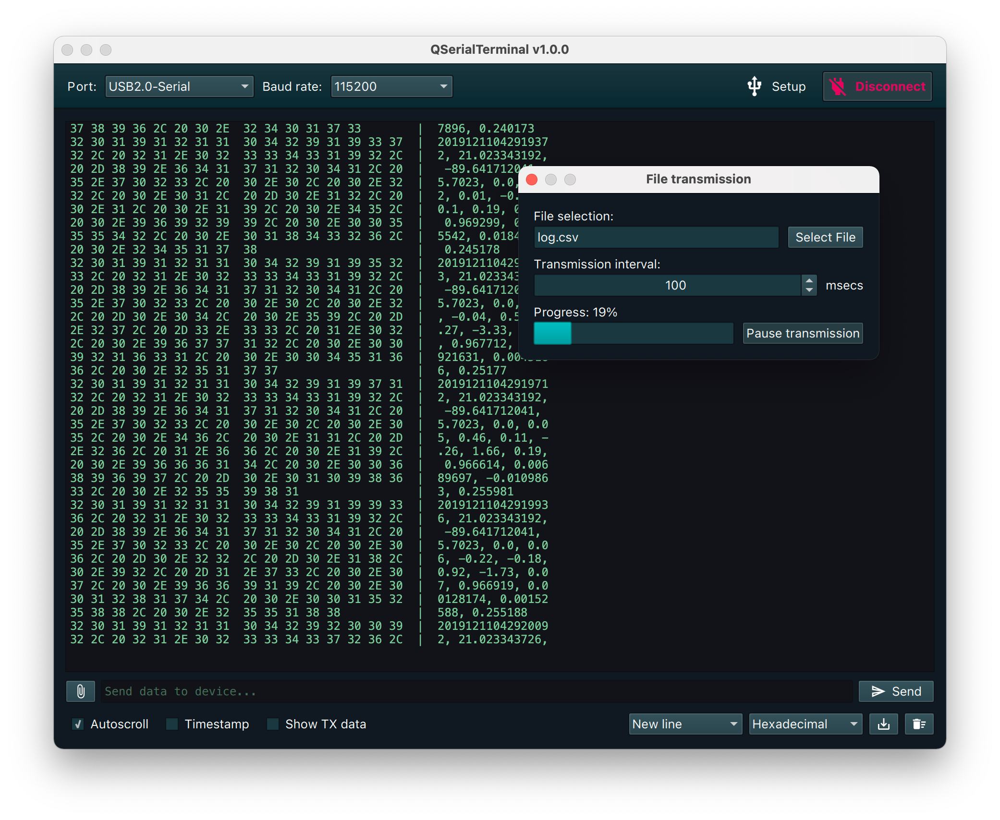

# QSerialTerminal

A simple, cross-platform serial port terminal application written with Qt/QML.

Features:
- Display data in text & hexadecimal format
- Line ending control
- Optional autoscrolling
- Export terminal output to file

## Compiling the application

Once you have Qt installed, open *QSerialTerminal.pro* in Qt Creator and click the "Run" button.

Alternatively, you can also use the following commands:

	qmake
	make -j4

## Licence

This project is released under the terms and conditions of the [MIT License](LICENSE.md).
